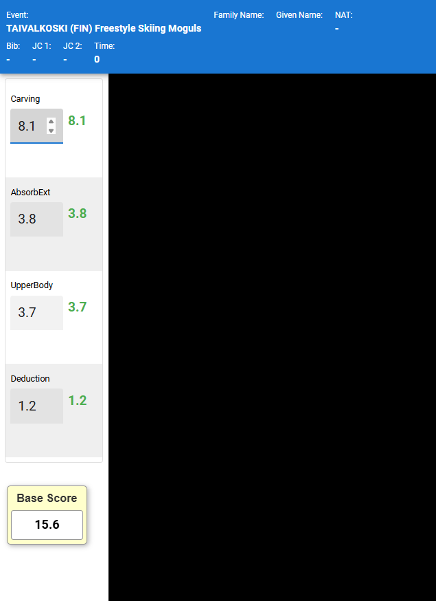

# ReadMe\_BaseScore\_Helper\_Bookmarklet

---
## Overview

This bookmarklet enhances the Judge Click scoring interface by automatically detecting and summing the **top three left-side score inputs** in real time. It displays the live calculated **Base Score** in a draggable floating panel. It is optimized to be to be run as a  **browser bookmarklet**, supports toggle hotkeys, and does not require any extensions.

---

| **Summary** | **Base Score Example:** |  **Short Video** | 
|----------|----------|----------|
| Enhaces the Judge Click interfaces by summing the three Turns Categories into a single  Base Score box   |  | Watch a short demo here: <a href="screenshots/Base_Score.gif">    </a>)  |


---

## Key Features

- 🎯 **Auto Sum of Top 3 Inputs** — Always detects the top three editable score fields.
- 📦 **Floating Base Score Panel** — Draggable, always on top, very light and readable.
- 🔴 **Debug Mode (D key)** — Shows live input ranks and values directly on screen.
- ⛔ **Script Toggle (S key)** — Hide/show the Base Score box and stop/start updates.
- ⚡ **Very lightweight** — Updates every 200ms, minimal impact on performance.

---

## To Use

1. Open Judge Click Tool
2. Click the Bookmark you saved (_see instructions below on how to create_)

> Note: Bookmarklet tool will only activate with Judge Click
> - Bookmarklets are deactivated for other Websites/URLs (will warn with "Tool only runs on judge.click")

---


## To Disable

Browser Refresh -->  Press F5

---

## Supported devices
   Supported in **Windows PC** (win11) and **macOS** (MacBook Pro and simliar)
   - Works just fine in Chrome (preferred with Judge.Click) but also works in Edge and Safari _(after enabling bookmarklet JavaScript permissions)_
   - Bookmarklets created in Chrome on Windows → syncs to Chrome on macOS → will work just fine

> Safari blocks JavaScript execution from bookmarklets unless user enables:
> - Settings → Safari → Advanced → Allow JavaScript from Smart Search Field  - more instruction here https://github.com/freedogski/Base-Score-Helper/blob/main/macOS%20Safari%20setup.md 
   
   **Mobile devices** - No guarantee that this will work on Android phones, tablets or iPad**, iPhones as the smaller screens may inhibit proper operation.  Can confirm Android phones not supported.

> ** One quirk to note with iPad (after limited testing) - Windows Chrome bookmark synced to iPad Chrome will **not** work due to differences in iPadOS

> To overcome this with **iPad**, always create bookmarklets in Safari first (_faster approach for iPad, jump straight to step 6_)
> 1. Even if you want them in Chrome on iPad
> 2. Create/Save the bookmarklet in Safari.
> 3. Edit the URL and paste your bookmarklet code.
> 4. Test it — it will work.
> 5. Copy that code into Chrome’s bookmark manually - to use in Chrome iPad.

Skip here - faster

> 6. Alternatively, the _Bookmarklet for iPad_ is provided below (but in case I forget to do this in the future, you need to do steps 1-5)


---
---

## Bookmarklet Instructions

The Instruction to create a bookmarklets:

1. Copy the full one-line compressed bookmarklet code below.
2. Open your browser and create a new bookmark from any working website (you will edit bookmark in next steps)
3. Edit the bookmark you created in step 2 and name the bookmark (e.g., **Base Score Tool**).   or whatever you prefer
4. Still in the bookmark added in step 2, in the URL/location field of the bookmark, paste the code exactly as it appears. (code below)
5. Now navigate to Judge Click, and simply click the bookmark you just updated in steps 3 and 4 to activate the script.

---

### Bookmarklet Code

Bookmarklet Code for **all devices** (except iPad - see below)
```
javascript:(()=>{if(!location.href.startsWith('https://judge.click/')){alert("This%20tool%20only%20runs%20on%20judge.click");return}let%20d=false,s=true;const%20g=e=>{if(!e)return%200;if(e.tagName==="INPUT")return%20parseFloat(e.value)||0;const%20t=e.querySelector("span,%20div");if(t){const%20n=parseFloat(t.innerText.replace(/[^\d.-]/g,""));if(!isNaN(n))return%20n}return%20e.dataset?.value?parseFloat(e.dataset.value)||0:0},top3=()=>[...document.querySelectorAll("input")].filter(e=>!e.readOnly&&!e.disabled&&e.getBoundingClientRect().left<200).map(e=>({el:e,top:e.getBoundingClientRect().top})).sort((a,b)=>a.top-b.top).slice(0,3).map(x=>x.el);let%20p=document.getElementById("baseScorePanel");if(!p){p=document.createElement("div");p.id="baseScorePanel";Object.assign(p.style,{position:"fixed",bottom:"160px",left:"10px",width:"130px",padding:"6px",background:"#ffffcc",border:"1px%20solid%20#999",borderRadius:"6px",textAlign:"center",zIndex:9999,boxShadow:"2px%202px%208px%20rgba(0,0,0,0.3)",cursor:"move"});document.body.appendChild(p);const%20e=document.createElement("div");e.innerText="Base%20Score";Object.assign(e.style,{fontSize:"18px",fontWeight:"600",color:"#333",marginBottom:"6px",fontFamily:"Arial,%20sans-serif"}),p.appendChild(e);const%20t=document.createElement("input");t.id="sumBox",t.readOnly=!0,Object.assign(t.style,{padding:"8px%2012px",fontSize:"20px",fontWeight:"bold",width:"100%",textAlign:"center",borderRadius:"4px",border:"1px%20solid%20#999"}),p.appendChild(t)}(()=>{let%20o=0,l=0,f=!1,c=(x,y)=>{f=!0,o=x-p.getBoundingClientRect().left,l=y-p.getBoundingClientRect().top},m=(x,y)=>{if(!f)return;p.style.left=`${x-o}px`,p.style.top=`${y-l}px`,p.style.bottom="auto"};p.addEventListener("mousedown",e=>{if(e.target.id==="sumBox")return;c(e.clientX,e.clientY),e.preventDefault()}),window.addEventListener("mousemove",e=>m(e.clientX,e.clientY)),window.addEventListener("mouseup",()=>{f=!1}),p.addEventListener("touchstart",e=>{if(e.target.id==="sumBox")return;const%20t=e.touches[0];c(t.clientX,t.clientY),e.preventDefault()},{passive:false}),window.addEventListener("touchmove",e=>{const%20t=e.touches[0];m(t.clientX,t.clientY)},{passive:false}),window.addEventListener("touchend",()=>{f=!1})})();const%20l=(e,t)=>{if(!d)return;let%20n=e._debugLabel;n||(n=document.createElement("div"),Object.assign(n.style,{position:"absolute",background:"rgba(255,0,0,0.85)",color:"#fff",fontSize:"11px",padding:"2px%205px",borderRadius:"3px",zIndex:99999,whiteSpace:"nowrap",pointerEvents:"none"}),e._debugLabel=n,document.body.appendChild(n));const%20a=e.getBoundingClientRect();n.style.left=`${a.left+scrollX-2}px`,n.style.top=`${a.top+scrollY-a.height*.9}px`,n.textContent=t,n.style.display="block"};const%20u=()=>{if(!s)return;const%20e=top3(),t=e.reduce((a,o)=>a+g(o),0),n=document.getElementById("sumBox");n&&(n.value=t.toFixed(1)),document.querySelectorAll(".sum-highlight").forEach(a=>{a.style.outline="",a._debugLabel&&(a._debugLabel.style.display="none")}),e.forEach((a,o)=>{a.classList.add("sum-highlight"),a.style.outline="2px%20solid%20red",d&&l(a,`${o+1}: ${g(a).toFixed(1)}`)})};setInterval(u,200),document.addEventListener("keydown",e=>{e.key.toLowerCase()==="d"&&(d=!d,console.log("Debug labels:",d),u()),e.key.toLowerCase()==="s"&&(s=!s,console.log("Script active:",s),document.getElementById("baseScorePanel")&&(document.getElementById("baseScorePanel").style.display=s?"block":"none"),u())}),u()})();
```

---

> Bookmarklet Code - special case only for **iPad**
```
javascript:(()=>%7Bif(!location.href.startsWith('https://judge.click/'))%7Balert("This tool only runs on judge.click");return%7Dlet d=false,s=true;const g=e=>%7Bif(!e)return 0;if(e.tagName==="INPUT")return parseFloat(e.value)%7C%7C0;const t=e.querySelector("span, div");if(t)%7Bconst n=parseFloat(t.innerText.replace(/%5B%5E%5Cd.-%5D/g,""));if(!isNaN(n))return n%7Dreturn e.dataset?.value?parseFloat(e.dataset.value)%7C%7C0:0%7D,top3=()=>%5B...document.querySelectorAll("input")%5D.filter(e=>!e.readOnly&&!e.disabled&&e.getBoundingClientRect().left<200).map(e=>(%7Bel:e,top:e.getBoundingClientRect().top%7D)).sort((a,b)=>a.top-b.top).slice(0,3).map(x=>x.el);let p=document.getElementById("baseScorePanel");if(!p)%7Bp=document.createElement("div");p.id="baseScorePanel";Object.assign(p.style,%7Bposition:"fixed",bottom:"160px",left:"10px",width:"130px",padding:"6px",background:"%23ffffcc",border:"1px solid %23999",borderRadius:"6px",textAlign:"center",zIndex:9999,boxShadow:"2px 2px 8px rgba(0,0,0,0.3)",cursor:"move"%7D);document.body.appendChild(p);const e=document.createElement("div");e.innerText="Base Score";Object.assign(e.style,%7BfontSize:"18px",fontWeight:"600",color:"%23333",marginBottom:"6px",fontFamily:"Arial, sans-serif"%7D),p.appendChild(e);const t=document.createElement("input");t.id="sumBox",t.readOnly=!0,Object.assign(t.style,%7Bpadding:"8px 12px",fontSize:"20px",fontWeight:"bold",width:"100%25",textAlign:"center",borderRadius:"4px",border:"1px solid %23999"%7D),p.appendChild(t)%7D(()=>%7Blet o=0,l=0,f=!1,c=(x,y)=>%7Bf=!0,o=x-p.getBoundingClientRect().left,l=y-p.getBoundingClientRect().top%7D,m=(x,y)=>%7Bif(!f)return;p.style.left=%60$%7Bx-o%7Dpx%60,p.style.top=%60$%7By-l%7Dpx%60,p.style.bottom="auto"%7D;p.addEventListener("mousedown",e=>%7Bif(e.target.id==="sumBox")return;c(e.clientX,e.clientY),e.preventDefault()%7D),window.addEventListener("mousemove",e=>m(e.clientX,e.clientY)),window.addEventListener("mouseup",()=>%7Bf=!1%7D),p.addEventListener("touchstart",e=>%7Bif(e.target.id==="sumBox")return;const t=e.touches%5B0%5D;c(t.clientX,t.clientY),e.preventDefault()%7D,%7Bpassive:false%7D),window.addEventListener("touchmove",e=>%7Bconst t=e.touches%5B0%5D;m(t.clientX,t.clientY)%7D,%7Bpassive:false%7D),window.addEventListener("touchend",()=>%7Bf=!1%7D)%7D)();const l=(e,t)=>%7Bif(!d)return;let n=e._debugLabel;n%7C%7C(n=document.createElement("div"),Object.assign(n.style,%7Bposition:"absolute",background:"rgba(255,0,0,0.85)",color:"%23fff",fontSize:"11px",padding:"2px 5px",borderRadius:"3px",zIndex:99999,whiteSpace:"nowrap",pointerEvents:"none"%7D),e._debugLabel=n,document.body.appendChild(n));const a=e.getBoundingClientRect();n.style.left=%60$%7Ba.left+scrollX-2%7Dpx%60,n.style.top=%60$%7Ba.top+scrollY-a.height*.9%7Dpx%60,n.textContent=t,n.style.display="block"%7D;const u=()=>%7Bif(!s)return;const e=top3(),t=e.reduce((a,o)=>a+g(o),0),n=document.getElementById("sumBox");n&&(n.value=t.toFixed(1)),document.querySelectorAll(".sum-highlight").forEach(a=>%7Ba.style.outline="",a._debugLabel&&(a._debugLabel.style.display="none")%7D),e.forEach((a,o)=>%7Ba.classList.add("sum-highlight"),a.style.outline="2px solid red",d&&l(a,%60$%7Bo+1%7D: $%7Bg(a).toFixed(1)%7D%60)%7D)%7D;setInterval(u,200),document.addEventListener("keydown",e=>%7Be.key.toLowerCase()==="d"&&(d=!d,console.log("Debug labels:",d),u()),e.key.toLowerCase()==="s"&&(s=!s,console.log("Script active:",s),document.getElementById("baseScorePanel")&&(document.getElementById("baseScorePanel").style.display=s?"block":"none"),u())%7D),u()%7D)();
```
---
---

## Hotkey Controls

| Key   | Function                             |
| ----- | ------------------------------------ |
| **D** | Toggle debug labels on/off - Default is off          |
| **S** | Toggle script (Base Score UI) on/off |

---

## Script Behavior

| Feature           | Behavior                                               |
| ----------------- | ------------------------------------------------------ |
| Score Detection   | Picks the top 3 visible input fields on the left side  |
| Panel Dragging    | Drag from the yellow background (not from the sum box) works with mouse or touch screen |
| Debug Labels      | Display ranking & numeric value ribbon above inputs    |
| Real-time Updates | 5 updates per second (200ms interval)                  |

---

## Code

The code is fully self-contained, readable, and documented with inline comments.

*(See main repository file for complete source code.)*

---

## Enhancements Roadmap

🔹 Add local storage to remember panel position between sessions 🔹 Add color themes (light/contrast/large text) 🔹 Add drag handles on debug labels for repositioning 🔹 Convert to full Chrome extension (with manifest v3)

Assessment on Performance impact to different devices

| Device                 | Typical Idle CPU Load | During Input Updates                         |
| ---------------------- | --------------------- | -------------------------------------------- |
| Modern MacBook (M1/M2) | <0.5%                 | ~1–2%                                        |
| Windows PC (i7)        | <1%                   | ~2–4%                                        |
| iPad (2020 Air)        | ~2%                   | ~6–10% (during active dragging/debug labels) |
| Older laptop (2015 i5) | ~3%                   | ~8–12%                                       |
| Android phone - High-end (Snapdragon 8 Gen 1–3, etc)  **not recommended** | ~2%                |   6–10%    |
| Android phone - Mid-range (Snapdragon 6/7, etc.)  **not recommended**  | ~3%                   |   10–15%      |

---

## License

MIT License — free to use, modify, share.

---

## Author

Created by freedogski, optimized for real competition scoring workflows.

---

