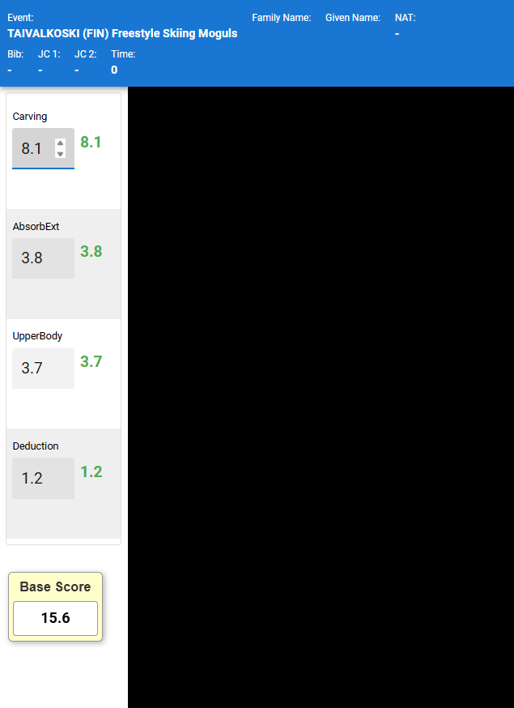
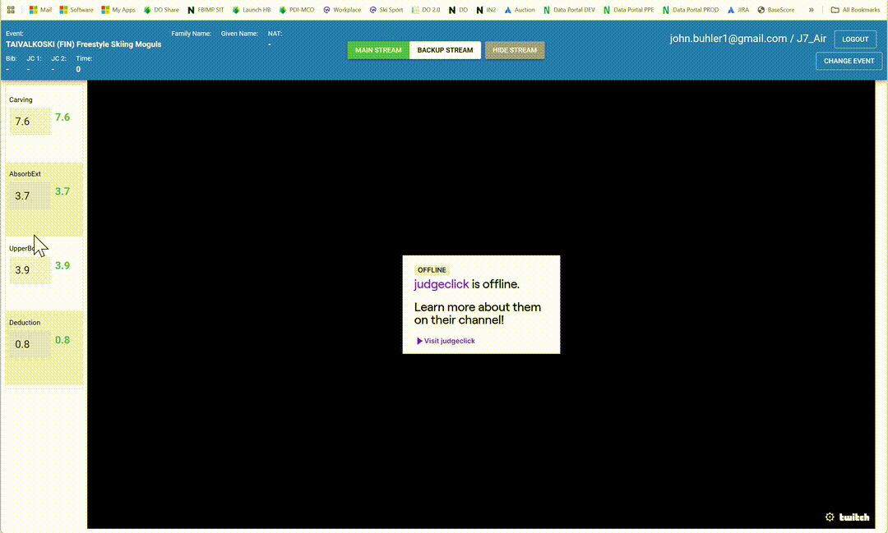

# ReadMe\_BaseScore\_Helper\_Bookmarklet

---
## Overview

This bookmarklet enhances the Judge Click scoring interface by automatically detecting and summing the **top three score inputs from the right-side score area** in real time. It displays the live calculated **Base Score** in a draggable floating panel. It is optimized to be to be run as a **browser bookmarklet**, supports toggle hotkeys, and does not require any extensions.

---

| **Summary** | **Base Score Example:** |  **Short Video** | 
|----------|----------|----------|
| Enhaces the Judge Click interfaces by summing the three Turns Categories into a single  Base Score box.     _Suggested to use only when Judge Click is in the mode where three Turns Categories are eanbled, as pictured on the right._   |  | Watch a short demo here: )  |

---

## Key Features

- 🎯 **Auto Sum of Top 3 Inputs** — Always detects the top three editable score fields.
- 📦 **Floating Base Score Panel** — Draggable, always on top, very light and readable.
- 🔴 **Debug Mode (D key)** — Shows live input ranks and values directly on screen.
- ⛔ **Script Toggle (S key)** — Hide/show the Base Score box and stop/start updates.
- ⚡ **Very lightweight** — Updates every 200ms, minimal impact on performance.

---

## To Use

1. Open Judge Click Tool
2. Click the Bookmark you saved (_see instructions below on how to create_)

> Note: Bookmarklet tool will only activate with Judge Click
> - Bookmarklets are deactivated for other Websites/URLs (will warn with "Tool only runs on judge.click")

---

## To Disable

Browser Refresh -->  Press F5

---

## Supported devices
   **Windows PC** (win11) and **macOS** (MacBook Pro and simliar)
   - Works just fine in PC with Chrome (preferred with Judge.Click) but also works in Edge, FireFox browswes
   - On Mac works with Chrome and Safari browsers. _(for Safari see below for enabling bookmarklet JavaScript permissions)_

     
   **Mobile devices** - No guarantee that this will work on Android phones, iPhones as the smaller screens may inhibit proper operation.  Can confirm Android phones not supported.

---
---

## Bookmarklet Instructions

The Instruction to create a bookmarklets:

1. Copy the full one-line compressed bookmarklet code below.
2. Open your browser and create a new bookmark from any working website (you will edit bookmark in next steps)
3. Edit the bookmark you created in step 2 and name the bookmark (e.g., **Base Score Tool**).   or whatever you prefer
4. Still in the bookmark added in step 2, in the URL/location field of the bookmark, paste the code exactly as it appears. (code below)
5. Now navigate to Judge Click, and simply click the bookmark you just updated in steps 3 and 4 to activate the script.

 > 💡 **Tip**  check here [BaseScore setup instructions video](https://github.com/freedogski/Base-Score-Helper/blob/main/screenshots/BaseScore_setup_instructions.mp4)

---

### Bookmarklet Code

### Version 2.0 (right-side Judge Click score area)

Use the shorter minified v2 bookmarklet one-liner from this file (recommended):
- [code/bookmarklet_v2.0.min.txt](code/bookmarklet_v2.0.min.txt)

If your browser ignores the encoded version, use this fallback instead:
- [code/bookmarklet_v2.0.min.raw.txt](code/bookmarklet_v2.0.min.raw.txt)

How to use v2 quickly:
1. Open [code/bookmarklet_v2.0.min.txt](code/bookmarklet_v2.0.min.txt)
2. Copy the full single line.
3. Paste it into your bookmark URL/location field.
4. Run it on Judge Click.

If v2 does not run:
1. Delete the old v2 bookmark and create a brand-new bookmark.
2. Confirm the URL starts with `javascript:` (exactly).
3. Try [code/bookmarklet_v2.0.min.raw.txt](code/bookmarklet_v2.0.min.raw.txt) as fallback.

v2 defaults:
- Reads the 3 score inputs from the right-side score area first.
- Opens Base Score in the lower-right corner by default.

Supported platforms for v2.0:
- PC: Chrome, Edge, Firefox
- macOS: Chrome or Safari
- iPadOS: Safari first, then optionally copy to Chrome

Safari setup note (macOS + iPad):
- Settings > Safari > Advanced > Allow JavaScript from Smart Search Field
- If needed, see [macOS Safari setup.md](macOS%20Safari%20setup.md)

iPad setup note:
- Create the bookmark directly in Safari on iPad first.
- If you use Chrome on iPad, manually copy the working Safari bookmark URL into a Chrome bookmark.

---
---

## Hotkey Controls

| Key   | Function                             |
| ----- | ------------------------------------ |
| **D** | Toggle debug labels on/off - Default is off          |
| **S** | Toggle script (Base Score UI) on/off |

---

## Script Behavior

| Feature           | Behavior                                               |
| ----------------- | ------------------------------------------------------ |
| Score Detection   | v2.0 targets the top 3 inputs in the right-side score area first (with fallback). |
| Panel Dragging    | Drag from the yellow background (not from the sum box) works with mouse or touch screen |
| Debug Labels      | Display ranking & numeric value ribbon above inputs    |
| Real-time Updates | 5 updates per second (200ms interval)                  |

---

## Code

The code is fully self-contained, readable, and documented with inline comments.

*(See main repository file for complete source code.)*

---

## Enhancements Roadmap

🔹 Add local storage to remember panel position between sessions 🔹 Add color themes (light/contrast/large text) 🔹 Add drag handles on debug labels for repositioning 🔹 Convert to full Chrome extension (with manifest v3)

Assessment on Performance impact to different devices

| Device                 | Typical Idle CPU Load | During Input Updates                         |
| ---------------------- | --------------------- | -------------------------------------------- |
| Modern MacBook (M1/M2) | <0.5%                 | ~1–2%                                        |
| Windows PC (i7)        | <1%                   | ~2–4%                                        |
| iPad (2020 Air)        | ~2%                   | ~6–10% (during active dragging/debug labels) |
| Older laptop (2015 i5) | ~3%                   | ~8–12%                                       |
| Android phone - High-end (Snapdragon 8 Gen 1–3, etc)  **not recommended** | ~2%                |   6–10%    |
| Android phone - Mid-range (Snapdragon 6/7, etc.)  **not recommended**  | ~3%                   |   10–15%      |

---

## License

MIT License — free to use, modify, share.

---

## Author

Created by freedogski, optimized for real competition scoring workflows.

---

